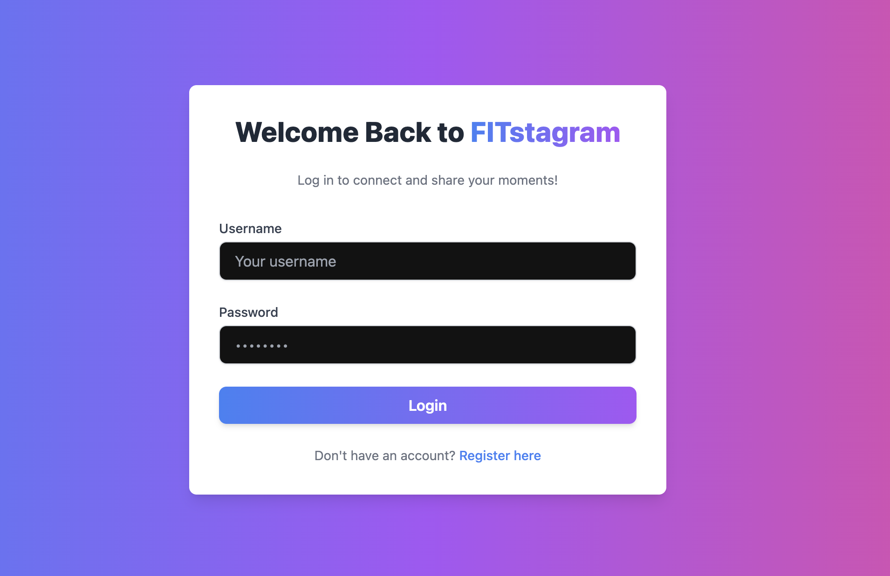
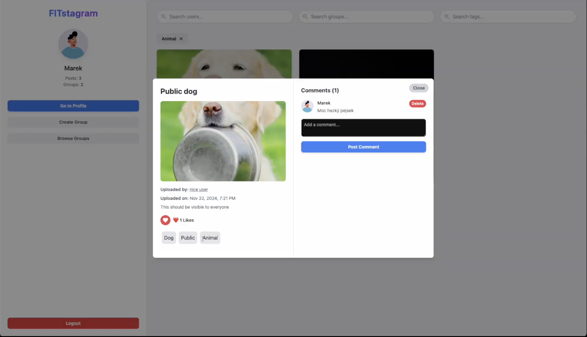

# FITstagram 📸💪

**FITstagram** is a full-stack social web application built for sharing workout-related content and connecting users through interest-based groups. Created as a part of the **Information Systems (IIS)** course at Brno University of Technology.

> 🧪 Built with **React**, **Node.js**, **Express**, and **Prisma ORM**.

🌐 Live Demo: https://fitstagram-iis.onrender.com  
_(Please allow up to 30–60 seconds for the free Render server to spin up.)_

---

## 🚀 Features

- 👤 User authentication and profile management
- 🏋️‍♂️ Post creation and interaction (with photos and comments)
- 🛡️ Admin and moderator roles with content and user moderation
- 🔐 Role-based content visibility (private/public photos)
- 🏘️ Group creation, management, and member requests
- 🔎 Search and filtering by tags and groups

---

## 🧑‍💻 Tech Stack

- **Frontend:** React, React Router
- **Backend:** Node.js, Express
- **Database:** PostgreSQL + Prisma ORM
- **Auth:** JWT-based authentication
- **Hosting:** Render

---

## 📁 System Roles (Demo Users)

| Login     | Password  | Role            |
| --------- | --------- | --------------- |
| admin     | admin     | Administrator   |
| moderator | moderator | Moderator       |
| 123       | 123       | Registered User |

---

## 🛠️ Installation

### 1. Configure Environment Variables

Create a `.env` file in the `backend` directory:

```
DATABASE_URL=your_postgres_url
JWT_SECRET=your_jwt_secret
NODE_ENV=development
```

### 2. Backend Setup

```
npm install
cd backend
npx prisma generate
npm run dev
```

### 3. Frontend Setup

```
cd frontend
npm install --legacy-peer-deps
npm run dev
```

---

## 🗃️ Screenshots





---

## 👥 Authors

- Jakub Zelenay - Admin/moderator rights, tag system, photo visibility control

- Marek Joukl - Environment setup, auth, layout, user profile, post/comment management

- Ondrej Kožányi - Group management, membership requests, search/filter by group, group photo sharing

---

## ⚠️ Known Issues

- Comments can only be created or deleted (not edited).
- Blocked users are fully restricted from interaction (simplified for assignment clarity).
- Photo uploads are limited to link only (no local storage).

---

## 📝 License

MIT License – feel free to explore, modify, or contribute!
